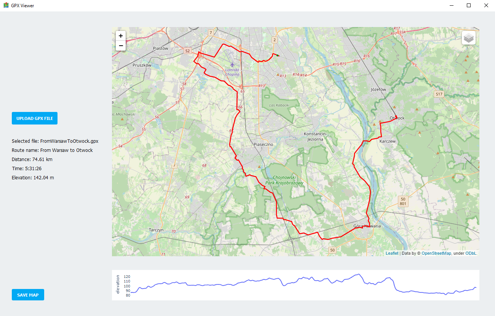

# gpxViewer
gpxViewer is a desktop aplication to show gpx route on map and calculate route distance, time, elevation. Map with route line can be saved as html file. Application uses folium OpenStreetMaps.

## Technologies
* Python 3.8
* PyQt5

## Application view

